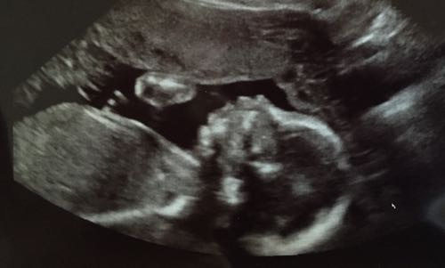

```{r global_options, include=FALSE}
knitr::opts_chunk$set(dev='png',fig.path='Figs/',
                      echo=TRUE, warning=FALSE, message=FALSE,tidy=TRUE)
```


#Motivating Question

Earlier this month, Donald Trump was the favorite of 32% of Republicans with a margin of error of 4.5 percentage points. 

**What does this mean? What does the margin of error depend on?**

#Motivating Question

CNN/ORC International completed this poll. 

1,012 adults were polled, 930 of whom were registered voters, by landline and cellphone from September 4 to 8. 

Of the registered voters, 474 described themselves as Republicans or independents who lean Republican. 


#Sampling

In order to gauge a sense of the *entire* U.S. voting population, ORC International got a sample of size $n =1,012$.

```{r echo=FALSE}
par(mar=c(0,0,0,0))
symbols(0,0,rect=cbind(8,1),bty='n',ylab='',xlab='',yaxt='n',xaxt='n',xlim=c(-5,5),inches=FALSE,ylim=c(-3,1.5))
text(0,0,'Population')
text(0,-.2,'size = N',cex=.8)
symbols(0,-2,circle=1,add=TRUE,inches=FALSE)
text(0,-2,'Sample')
text(0,-2.2,'size = n',cex=.8)
arrows(0,-0.5,0,-1.5)
```

**What else do you want to know about the sample from ORC?**

#A sample of sample questions

- How did they chose the sample? (randomly chose phone numbers?)
- How many phone numbers did they actually call?
- How many people did not answer their phone or hung up?
- How are the people who participated different than those who refused to participate, directly or indirectly (non-responders)?
- What percentage of these people are likely voters?
- Is the sample representative in terms of gender, race, socioeconomics, etc?

#Random Sampling
In order to get a representative sample, it is best to **sample randomly** (if possible). <span style='font-size:15px'>We'll get to detailed ways of sampling later</span>

- For the time, let's imagine that we could get a list of everyone in the population and put their names in a hat. 


- In order to get a random sample of size $n$, we draw $n$ names out of the hat without replacement (*yes, this is simplistic and not realistic*). 


#Babies of 1998
Let's set Trump and his 32% aside for a moment to talk about BABIES!




#Babies of 1998
In this rare instance, we have a list of an entire population (a **census**); all children born in the U.S. in 1998, from the Census Bureau and National Center for Health Statistics. 

For the moment, let's see if I can make it to the end of the semester (Last day of class: 39.14 weeks).

```{r}
par(mar=c(5,4,4,1)) #setting the margins of the plotting region
load('~/Dropbox/Shared Files/BABIES1998.Rda')
head(babies1998) #See the first 6 rows
babies1998dec <- babies1998[babies1998$dobmm == 12,] #[rows, columns]
with(babies1998dec,summary(gestation))
with(babies1998dec,hist(gestation,xlab='Gestation (weeks)',main='1998 Population',xlim=c(15,50)))
```

**What do you learn?**

#Babies of 1998
To mimic Trump situation, 

let's imagine taking a "poll" of gestional ages through a random sample of 1000 babies born in December 1998.


#Random Sample #1 of 1998 Babies

Let's take a random sample (without replacement) of size $n=1000$ and look at the distribution of their gestational age.

```{r}
require(mosaic)
smp <- sample(babies1998dec, size = 1000, replace = FALSE)
with(smp, hist(gestation, xlab='Gestation (weeks)', main='Random Sample #1', xlim=c(15,50)))
with(smp, summary(gestation))
```

#Random Sample #2 of 1998 Babies

Let's take **another, different** random sample (without replacement) of size $n=1000$ and look at the distribution of their gestational age.

```{r}
smp2 <- sample(babies1998dec, size = 1000, replace=FALSE)
with(smp2, hist(gestation,xlab='Gestation (weeks)',main='Random Sample #2',xlim=c(15,50)))
with(smp2, summary(gestation))
```

Here is an interactive website to do this: https://r.amherst.edu/apps/nhorton/histogram-gestation/

**What do you notice?**

#Interesting Things of Note

- The **distribution of the gestational ages in the sample** are *similar* to the **distribution of the gestational age in the population** (in terms of shape, center, spread); outliers could be in or out the sample.

- The sample statistics (**statistic**: a numerical summary of data) vary between the samples (examples of statistics: mean, median, Q1, Q3, IQR, sd, etc)


#Simulating Random Samples

Now, let's draw 2,500 random samples of size $n=1000$, and calculate the mean for each sample (the `do` function in R helps us "do" this sampling multiple times). 

- Below is a histogram of all of the sample means from 2,500 samples of size $n=1000$.

```{r}
sample.means <- do(2500)*with(sample(babies1998dec, size = 1000, replace=FALSE), mean(gestation,na.rm=TRUE)) #takes some time to run

hist(sample.means[,1],xlab='Sample Mean Gestation (weeks)',main='2500 Simulated Random Samples')
favstats(sample.means[,1]) #just want the first column
```

**What do you learn?**


#Interesting Things to Note
- If you were to take random samples of size $n=1000$, we see how much the mean gestational age would vary amongst the samples. 

- Notice that the center of this distribution is the same as the population mean (38.8 weeks).

- If we were able to get every possible random sample of size $n$ (every possible combination of $n$ babies) and calculate the sample mean, then the histogram of those means would be the **sampling distribution** of the sample means.

#Summary

If we have the population, we can **simulate the sampling distribution of any statistic** (mean, median, IQR, sd, etc).


#Back to Trump
We had one sample of total size $1,012$ (the subset of registered "Republicans" was $n=474$). 

BUT,
- We don't know the population (that is the point of the poll). 
- We want to know how "far from the truth" we could be due to sampling variation. 

##Pulling ourselves by our Bootstraps
Assuming **our sample is representative of the population** (which is a big assumption), let's pretend the **sample is our population ** (in that 32% of the "Republications" in the U.S. favor Trump).

##Pulling ourselves by our Bootstraps
Now, let's do the same type of thing as we did before with the BABIES. We will draw a random sample of size $n=474$ from our fake "population" (but we need to sample **with replacement**, aka resample).

```{r}
trump.sample <- c(rep('Favor',round(.32*474)), rep('Do not',round(.68*474)))
table(trump.sample)
smp <- resample(trump.sample)
prop.table(table(smp)) #relative frequency (aka proportion)
```

##Another Resample
Let's take another random sample of size $n=474$ from our "population".

```{r}
smp2 <- resample(trump.sample)
prop.table(table(smp2)) #relative frequency (aka proportion)
```

**What do you learn?**

##Resample Many Times
Now, let's get 2500 random samples of size $n=474$.

```{r}
sample.props <- do(2500)*prop.table(table(resample(trump.sample)))[2]

hist(sample.props[,1],xlab='Sample Proportion who Favors Trump',main='2500 Bootstrapped Random Samples')
favstats(sample.props[,1])
```

**What do you notice?**

#Interesting Things to Note
- Center of this distribution is close to 32% (the original polling sample proportion).
- Sample proportions vary.
- Most sample proportions are within about 5 percentage points from the center.


#Simulated v. Bootstrapped
**What are some similarities and differences between these two distributions?**

```{r,fig.width = 10}
par(mfrow=c(1,2))
hist(sample.means[,1],xlab='Sample Mean Gestation (weeks)',main='2500 Simulated Random Samples')
hist(sample.props[,1],xlab='Sample Proportion who Favors Trump',main='2500 Bootstrapped Random Samples')
```


#Simulated v. Bootstrapped
- Both give sense of sampling variability
- Both are unimodal, roughly symmetric distributions

- Mean v. Proportion
- Population vs. Fake Population
- Simulated sampling distribution vs. Bootrapped sampling distribution
- Centered at Population Mean vs. Centered at Sample Proportion

