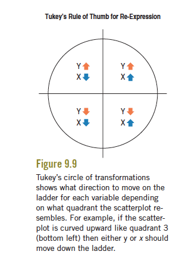

```{r global_options, include=FALSE}
knitr::opts_chunk$set(dev='png',fig.path='Figs/',echo=TRUE,message=FALSE, warning=FALSE,message=FALSE,tidy=TRUE,fig.width = 6,fig.height=6)
```

## Review of Regression (Least Squares)
Using calculus, to minimize the sum of square residuals (SSE), the "best" fitting line is based on intercept,
$$ b_0 = \bar{y} - b_1 \bar{x}$$

and the slope,

$$ b_1 = r \frac{s_y}{s_x}$$

Resulting predictions for y (plug in value of x):

$$\hat{y_i} = b_0 + b_1 x_i$$

Residuals:

$$e_i = y_i - \hat{y_i}$$

How to interpret regressing to the mean (standardized variables):

$$\hat{z}_{y_{i}} = r z_{x_{i}}$$

---


##How useful is the line?

$$ SSE = \sum({y_i - \hat{y_i}})^2$$

This is what we minimized with least squares. How did we do?

$$ s_e = \sqrt{\frac{\sum e_i^2}{n-2}} =\sqrt{\frac{SSE}{n-2}}  $$

This is the estimated **standard deviation of the residuals** (In R, called Residual Standard Error). 

Often we call $\frac{SSE}{n-2}$ the *Mean Squared Error* or **MSE**, so $s_e = \sqrt{MSE}$ is also called the **Root Mean Squared Error**. 

This estimates the (true) standard deviation of the errors and gives us, in the best possible case, a rough idea of how precisely we can predict $y$. (Take $\pm 2\cdot s_e$) 

------------------

##Example

```{r echo=FALSE}
sat <- read.delim("http://www.stats4stem.org/uploads/1/7/6/7/1767713/sat.txt",header=TRUE,sep = ' ')
```

Can I predict your college GPA based on your high school GPA?

```{r}
with(sat,plot(univ_GPA~high_GPA,xlab='HS GPA',ylab='College GPA'))
lm.gpa=lm(univ_GPA~high_GPA,data=sat)
abline(lm.gpa,col="red",lwd=2)
#summary(lm.gpa)
lm.gpa
```

---------

##How close can I get?

```{r}
SSE = sum(residuals(lm.gpa)^2)
n = (length(residuals(lm.gpa)))
s = sqrt(SSE/(n-2))
s
2*s
```

So I can predict your GPA within about $0.56$ GPA points in the best case. Is this any good? 

```{r}
sd(sat$univ_GPA)
2*sd(sat$univ_GPA)
```

Without knowing your high school GPA, we could have guessed within $\pm 0.89$.  That was based on 

$$ SST = \sum{(y_i -\bar{y})^2} $$

SST is the numerator of the variance of $y$ (without knowing anything about $x$).

```{r}
(SST = sum((sat$univ_GPA - mean(sat$univ_GPA))^2))
```

----------


##Compare the Residual Variation to the Original Variation

```{r, echo=FALSE}
boxplot(residuals(lm.gpa),sat$univ_GPA-mean(sat$univ_GPA),col=c("lightblue","lightgreen"),names=c("Linear Model Residuals","Original Deviations from Mean"))
```

Let's study the reduction in the variance (residuals -- with $x$ v. the original -- without $x$). 

Technically, we just compare their sum of squares (that is, we don't divide by anything).

-----------


##$R^2$

We started with $SST = \sum{(y_i - \bar{y})^2}$ before we had info about high school GPA ($x$).

Now, with our knowledge of $x$, we have $SSE = \sum{(y_i - \hat{y_i})^2}$

$SSE$ should be smaller than $SST$ (!)

Two extreme cases: 

  * If the error goes to zero, we'd have a "perfect fit". 
  
  * If $SSE = SST$, $x$ has told us nothing about $y$.

So we define:

$$ R^2 = 1 - \frac{SSE}{SST} $$

```{r}
1 - SSE/SST
summary(lm.gpa) #Multiple R-square = R^2
```

$R^2$ can be interpreted as the *fraction* of the total variation in $y$ "accounted for" by the model in $x$. 

Is there a "good" value of $R^2$? Same answer as correlation -- no.

Also, $R^2$ doesn't tell you the direction of the relationship.

---

##Looking at Residuals

Residuals are what's left over from a regression fit. We can actually learn a lot by studying them. INSERT POOP JOKE. 

What do we need for Regression to make sense? (conditions)

  * Variables are both **Quantitative**
  
  * Relationship is **Straight Enough**
  
  * There are no **Outliers** 
  
  * Spread is roughly same throughout -- the **Does the Plot Thicken?** condition
  
To check these we look at the original scatterplot and a plot of *residuals* vs. *predicted values* (or against *x*, but $\hat{y}$ is a linear function of $x$, so except for a possible change of sign, it's the same plot. Makes is easier when we add more $x's$).

```{r}
plot(residuals(lm.gpa)~predict(lm.gpa),xlab="Predicted College GPA",ylab="Residual")
```

What do you think?

  * Is there any pattern? (Is the original scatterplot straight enough?)
  * Is there equal spread across prediction values?

------------------------

##Example

Does this satisfy the conditions?

```{r, echo=FALSE}

x=runif(100,.75,3)  # Random points for x
y=1.5*(x-2)^2+15+2*x+rnorm(100)

data=data.frame(x=x,y=y)
with(data,plot(y~x))

lm1=lm(y~x,data=data)

abline(lm1,lwd=2)
```


------------------------

##What can go wrong?


```{r, echo=FALSE}

x=runif(100,.75,3)  # Random points for x
y=1.5*(x-2)^2+15+2*x+rnorm(100)

data=data.frame(x=x,y=y)
with(data,plot(y~x))

lm1=lm(y~x,data=data)

abline(lm1,lwd=2)
```

Adding a line can fool the eye somewhat.

```{r, echo=FALSE}
with(data,plot(y~x))
```

Residual plot is a better way to see the problem:

```{r, echo=FALSE}
plot(residuals(lm1)~predict(lm1))
abline(h=0,lty=2)
```

Sometimes it helps to put a smooth line through the residuals.

```{r, echo=FALSE}
scatter.smooth(residuals(lm1)~predict(lm1), pch=19, cex=.6, bty="n")
abline(h=0,lty=2)
```


-------------

##Transformations

So what do we do when the scatterplot isn't straight (the residual plot has a pattern) or when there is unequal variability (there is thickening)?

We might be able to **transform** either $y$ or $x$. 

We'll start by trying to transform $y$. You could try different re-expressions at random -- like $\sqrt{y}$, $\log(y)$ or $1/y$... But is there a more systematic way to find one? 


Imaging a "ladder of powers" of $y$  (or $x$):

$$
\vdots\\
y^3\\
y^2\\
y\\
\sqrt{y}\\
y^{1/3}\\
y^{"0"} ~~~  (we~use~\log(y)~here )\\
y^{-1/3}\\
1/\sqrt{y}\\
1/y\\
1/y^2\\
\vdots
$$

We start at $y$ and think about going up or down the ladder. But which way?

---------

##Tukey's Circle of Transformations 

Our friend J.W. Tukey (the same guy who invented the boxplot) comes to the rescue.


Which part of the circle does the scatterplot most resemble?




```{r, echo=FALSE}
with(data,plot(y~x))
```


-----------


##Cars Example


```{r, fig.height=5, fig.width=10}
library(MASS)
par(mfrow=c(1,2))
with(Cars93,plot(MPG.city~Weight,pch=19,bty="n",cex=.8))
lm.cars=lm(MPG.city~Weight,data=Cars93)
abline(lm.cars,lwd=2)
with(Cars93,hist(MPG.city,col="lightgreen"))


Hummer=data.frame(Weight=6280)

predict(lm.cars,new=Hummer)
```
This doesn't predict very well for a Hummer!  


---

##Residuals

```{r}
scatter.smooth(residuals(lm.cars)~predict(lm.cars),pch=19,cex=.6,bty="n")
```

---

## Back to the Scatterplot

Which part of the circle does the scatterplot most resemble?

```{r,echo=FALSE}
with(Cars93,scatter.smooth(MPG.city~Weight,pch=19,bty="n",cex=.8))
```


The scatterplot looks like the lower left (3rd) quadrant. Tukey says to go down the ladder in $y$ (or $x$) (look at the arrows in each quadrant -- they match the sign of $x$ and $y$ there.)

-----------

##Down the Ladder

 Try going down one "rung" in $y$ to $\sqrt{MPG.City}$
 
```{r, fig.height=5, fig.width=10}
par(mfrow=c(1,2))
with(Cars93,scatter.smooth(sqrt(MPG.city)~Weight,pch=19,cex=.6,bty="n"))
lm.sq = lm(sqrt(MPG.city)~Weight,data = Cars93)
scatter.smooth(predict(lm.sq),residuals(lm.sq),pch=19,cex=.6,bty="n")
```

It's better, but we should go further:

---

##Try $log{(MPG.City)}$

```{r, fig.height=5, fig.width=10}
par(mfrow=c(1,2))
with(Cars93,scatter.smooth(log(MPG.city)~Weight,pch=19,cex=.6,bty="n"))
lm.log = lm(log(MPG.city)~Weight,data = Cars93)
scatter.smooth(predict(lm.log),residuals(lm.log),pch=19,cex=.6,bty="n")
```


Always go so further so that you actually have to come back.

---

## Try $\frac{-1}{MPG.City}$

```{r, fig.height=5, fig.width=10}
par(mfrow=c(1,2))
with(Cars93,scatter.smooth(-1/(MPG.city)~Weight,pch=19,cex=.6,bty="n"))
lm.inv = lm(I(-1/(MPG.city))~Weight,data = Cars93)
scatter.smooth(predict(lm.inv),residuals(lm.inv),pch=19,cex=.6,bty="n")
```

----------

##Are we there yet?

This looks good -- let's go one more:

```{r, fig.height=5, fig.width=10}
par(mfrow=c(1,2))
with(Cars93,scatter.smooth(-1/(MPG.city^2)~Weight,pch=19,cex=.6,bty="n"))
lm.inv2 = lm(I(1/(MPG.city)^2)~Weight,data = Cars93)
scatter.smooth(predict(lm.inv2),residuals(lm.inv2),pch=19,cex=.6,bty="n")
```

We've probably gone too far. Back to $1/MPG$.

---

##Can we find an automatic method?

**Box and Cox**

Here's the idea. We want to find the "best" power according to some criterion. It's roughly finding the power that maximizes the correlation. 

If we try a whole bunch of powers ($\lambda$s) and plot how they did in a graph, the "best" $\lambda$ is the one that maximizes this criteria.

BUT all the $\lambda$ between the dotted line did statistically as well as the best. So only use this as a guide!! 

Box and Cox proved some properties of this method, but that's not the most important point. It can serve as a rough guide of where to start.


Somewhere around $\lambda = -1.25$ is optimal, but all powers between about $-.75$ and $-1.75$ are statistically as good. $-1$ is convenient (and makes sense) so we'll go with that. 


```{r}
lm.cars = lm(MPG.city~Weight,data = Cars93) 
boxcox(lm.cars)
```

---

##Transforming Back

Once we transform a response and fit the line what do we do then?

For example,

```{r}
lm.recip=lm(I(-1/MPG.city)~Weight,data=Cars93)
Hummer=data.frame(Weight=6280)
predict(lm.cars,new=Hummer) # Not a good prediction ...
predict(lm.recip,new=Hummer) # A better prediction -- but what does it mean? 
-1/predict(lm.recip,new=Hummer)  #Aha!
```

------

##Bootstrapping a prediction

```{r}
library(mosaic)
preds=do(1000)*predict(lm(I(-1/MPG.city)~Weight,data=resample(Cars93)),new=Hummer)
names(preds)
Hummer.predmpg=-1/preds$"1"
hist(Hummer.predmpg)
quantile(Hummer.predmpg,c(0.025,0.975))
```


-----

##Things to remember 

-We're trying to straighten the lines (and equalize spread) with transformations

-Don't forget to look at residual plots after tranforming

-And don't forget to transform the predictions back! 

-No one wants the prediction of $-1/\sqrt{revenue}$


